<meta name="referrer" content="no-referrer"/>

# Rtems 源码阅读

RTEMS（Real‑Time Executive for Multiprocessor Systems）是一款始于 1988 年、1993 年正式发布的开源实时操作系统，专为多处理器嵌入式环境设计，支持 POSIX 和 BSD 套接字等开放标准 API，并可运行于 ARM、PowerPC、SPARC、MIPS、RISC‑V 等 18 种处理器架构及近 200 个 BSP（Board Support Package）上。它以库形式发布，应用程序与内核静态链接为单一映像，采用单地址空间、无用户/内核隔离设计，从而简化资源管理并确保确定性响应。2025 年 1 月 22 日发布的 6.1 版本全面将构建系统由 GNU Autotools 切换到基于 Python 的 Waf，大幅提升了构建速度并优化了依赖管理，同时引入了改进的调度算法和增强的 SMP 支持。

本文章用于记录阅读 Rtems 内核源码的笔记，尝试理解其中的逻辑。Rtems 内核的版本是 6.1，在线代码网站见 [https://rtems.davidingplus.cn/lxr/source/](https://rtems.davidingplus.cn/lxr/source/)。

本文章中涉及到的源码摘抄见项目 [DavidingPlus/rtems-source-code: Rtems 源码阅读。](https://github.com/DavidingPlus/rtems-source-code)。

<!-- more -->

# 文件系统

## 系统调用

### open()

open() 函数的调用流程图如下：

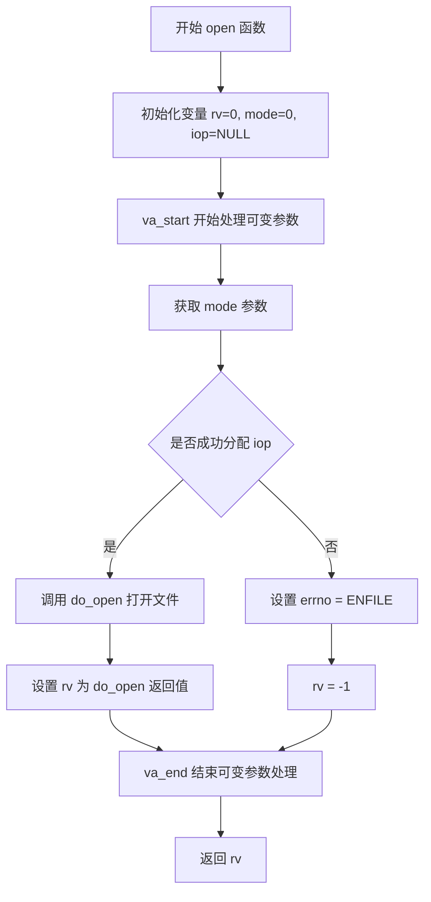

#### struct rtems_libio_t

rtems_libio_t 结构体定义如下。该结构体用于表示一个文件描述符的内部状态，Rtems 中每打开一个文件都会关联一个该结构体的实例，通常简称为 iop（I/O pointer）。

```c
typedef struct rtems_libio_tt rtems_libio_t;

struct rtems_libio_tt
{
    // 文件状态标志，使用原子类型以支持线程安全操作。
    // 可能标志：是否打开、读/写权限、文件类型等。
    Atomic_Uint flags;

    // 当前文件偏移量，用于读写操作时定位文件指针位置。
    off_t offset;

    // 文件路径定位信息，类似于 inode。
    // 包含挂载点、节点、驱动等信息，用于实际文件访问。
    rtems_filesystem_location_info_t pathinfo;

    // 驱动或文件系统使用的私有字段。
    // 通常用于存储轻量级状态、句柄或标志值。
    uint32_t data0;

    // 驱动或文件系统使用的扩展字段。
    // 可指向任意类型数据，支持更复杂的上下文管理。
    void *data1;
};
```

##### struct rtems_filesystem_location_info_t

rtems_filesystem_location_info_t 结构体定义如下。它表示一个路径位置，用于描述文件系统中某个具体节点（如文件或目录）的位置及其访问方式。

```c
// 表示文件系统中一个节点（如文件或目录）的位置及其访问信息。
typedef struct rtems_filesystem_location_info_tt
{
    // 用于将该节点插入到挂载点的链表中（如目录项列表）。
    rtems_chain_node mt_entry_node;

    // 指向具体节点的访问结构，一般是与具体文件系统实现相关的 inode 或数据结构。
    void *node_access;

    // 可选的第二个访问字段，供文件系统使用，如软链接或扩展元数据。
    void *node_access_2;

    // 指向该节点所使用的文件操作处理器集合（如 open、read、write、close 等函数指针）。
    const rtems_filesystem_file_handlers_r *handlers;

    // 当前节点所属的挂载表条目，表示该节点来自哪个挂载的文件系统。
    rtems_filesystem_mount_table_entry_t *mt_entry;

} rtems_filesystem_location_info_t;
```

##### struct rtems_filesystem_file_handlers_r

比较重要的成员是 `const rtems_filesystem_file_handlers_r *handlers`，该结构类似于 Linux 内核中的 file_operations，定义如下：

```c
/**
 * @brief File system node operations table.
 */
struct _rtems_filesystem_file_handlers_r
{
    // 打开文件的处理函数指针。
    rtems_filesystem_open_t open_h;

    // 关闭文件的处理函数指针。
    rtems_filesystem_close_t close_h;

    // 读取文件的处理函数指针。
    rtems_filesystem_read_t read_h;

    // 写入文件的处理函数指针。
    rtems_filesystem_write_t write_h;

    // 控制操作（如设备控制）的处理函数指针。
    rtems_filesystem_ioctl_t ioctl_h;

    // 文件位置指针移动（如 lseek）的处理函数指针。
    rtems_filesystem_lseek_t lseek_h;

    // 获取文件状态信息的处理函数指针。
    rtems_filesystem_fstat_t fstat_h;

    // 截断文件大小的处理函数指针。
    rtems_filesystem_ftruncate_t ftruncate_h;

    // 将文件缓冲区数据同步到存储设备的处理函数指针。
    rtems_filesystem_fsync_t fsync_h;

    // 同步文件数据（但不一定包括元数据）的处理函数指针。
    rtems_filesystem_fdatasync_t fdatasync_h;

    // 文件控制（如修改文件描述符属性）的处理函数指针。
    rtems_filesystem_fcntl_t fcntl_h;

    // 轮询文件状态（如是否可读写）的处理函数指针。
    rtems_filesystem_poll_t poll_h;

    // 用于事件过滤（BSD kqueue）的处理函数指针。
    rtems_filesystem_kqfilter_t kqfilter_h;

    // 读取多个缓冲区（向量读）的处理函数指针。
    rtems_filesystem_readv_t readv_h;

    // 写入多个缓冲区（向量写）的处理函数指针。
    rtems_filesystem_writev_t writev_h;

    // 内存映射文件的处理函数指针。
    rtems_filesystem_mmap_t mmap_h;
};
```

##### struct rtems_filesystem_mount_table_entry_tt

另一个成员是 struct rtems_filesystem_mount_table_entry_tt。这个结构体的作用是为每一个已挂载的文件系统提供一个集中式的描述，包含了文件系统的根节点信息、挂载点、类型、设备、访问控制状态等关键信息。对每个文件系统，Rtems 会维护一个这样的挂载表链表。在挂载和卸载文件系统时，Rtems 会对这个结构体进行相应的初始化、操作或释放。文件系统的挂载、查找路径、访问权限、卸载等都依赖于这个结构体中记录的信息。

```c
typedef struct rtems_filesystem_mount_table_entry_tt
    rtems_filesystem_mount_table_entry_t;

// 表示一个挂载的文件系统实例，是 Rtems 文件系统挂载表中的一项。
struct rtems_filesystem_mount_table_entry_tt
{
    // 用于将该挂载点插入全局挂载链表。
    rtems_chain_node mt_node;

    // 文件系统私有信息，由具体文件系统实现定义，如 ext2 的 superblock 信息。
    void *fs_info;

    // 指向文件系统操作函数表，定义如 mount、unmount、eval_path 等。
    const rtems_filesystem_operations_table *ops;

    // 文件系统的常量信息，不可变，例如初始挂载参数。
    const void *immutable_fs_info;

    // 该文件系统中所有节点的全局链表，便于遍历。
    rtems_chain_control location_chain;

    // 表示该文件系统挂载在哪个目录（挂载点）上。
    rtems_filesystem_global_location_t *mt_point_node;

    // 表示该文件系统的根节点位置。
    rtems_filesystem_global_location_t *mt_fs_root;

    // 是否已挂载成功。
    bool mounted;

    // 是否支持写操作。
    bool writeable;

    // 是否禁止创建设备节点和普通文件（mknod）。
    bool no_regular_file_mknod;

    // 该文件系统的路径名限制和选项。
    const rtems_filesystem_limits_and_options_t *pathconf_limits_and_options;

    // 挂载点路径字符串，例如 "/mnt/usb"。
    const char *target;

    // 文件系统类型名称，例如 "imfs"、"devfs"、"nfs" 等。
    const char *type;

    // 设备名称，如 "/dev/sda1"，以字符串形式表示，供底层文件系统使用。
    char *dev;

    // 发起卸载操作的任务 ID，卸载完成后通过事件通知该任务。
    rtems_id unmount_task;
};
```

在 RTEMS 中，文件系统的操作由 rtems_filesystem_operations_table 结构体统一管理，它定义了路径解析、节点创建、删除、克隆等核心操作函数，作用上相当于 Linux 中的 inode_operations。每个挂载的文件系统通过 rtems_filesystem_mount_table_entry_t 表示，类似于 Linux 的 super_block，其中包含了指向操作表 ops 的指针。当用户发起如 open、read、write 等文件访问请求时，系统首先通过 eval_path_h 函数解析路径并定位到目标节点，然后使用该节点中挂载的 rtems_filesystem_file_handlers_r（类似 Linux 的 file_operations）来完成具体操作。整个设计将挂载管理、路径解析和文件操作职责分离，形成清晰的模块边界，同时借鉴了 Linux 文件系统架构的思想。

```c
struct _rtems_filesystem_operations_table
{
    // 挂载点加锁函数，防止并发访问挂载点结构。
    rtems_filesystem_mt_entry_lock_t lock_h;

    // 挂载点解锁函数，与 lock_h 成对使用。
    rtems_filesystem_mt_entry_unlock_t unlock_h;

    // 路径解析函数，将路径转换为文件系统节点。
    rtems_filesystem_eval_path_t eval_path_h;

    // 创建硬链接的函数。
    rtems_filesystem_link_t link_h;

    // 判断两个节点是否表示同一对象的函数。
    rtems_filesystem_are_nodes_equal_t are_nodes_equal_h;

    // 创建文件系统节点（如文件、目录、设备节点）的函数。
    rtems_filesystem_mknod_t mknod_h;

    // 删除文件系统节点的函数。
    rtems_filesystem_rmnod_t rmnod_h;

    // 更改节点权限的函数，相当于 chmod。
    rtems_filesystem_fchmod_t fchmod_h;

    // 更改节点所有者信息的函数，相当于 chown。
    rtems_filesystem_chown_t chown_h;

    // 克隆节点的函数，通常用于目录项引用增加时复制节点。
    rtems_filesystem_clonenode_t clonenod_h;

    // 释放节点资源的函数，通常在节点引用减少到 0 时调用。
    rtems_filesystem_freenode_t freenod_h;

    // 文件系统挂载处理函数，处理实际挂载逻辑。
    rtems_filesystem_mount_t mount_h;

    // 文件系统卸载处理函数，释放挂载相关资源。
    rtems_filesystem_unmount_t unmount_h;

    // 文件系统自定义卸载钩子，用于挂载入口被清理时的回调。
    rtems_filesystem_fsunmount_me_t fsunmount_me_h;

    // 修改节点时间戳信息的函数，相当于 utimensat。
    rtems_filesystem_utimens_t utimens_h;

    // 创建符号链接的函数。
    rtems_filesystem_symlink_t symlink_h;

    // 读取符号链接目标路径的函数。
    rtems_filesystem_readlink_t readlink_h;

    // 重命名文件或目录的函数。
    rtems_filesystem_rename_t rename_h;

    // 获取文件系统统计信息的函数，如空间大小、inode 数等。
    rtems_filesystem_statvfs_t statvfs_h;
};
```

#### rtems_libio_allocate()

open 函数中分配文件描述符结构使用的函数是 rtems_libio_allocate()，执行流程图如下：

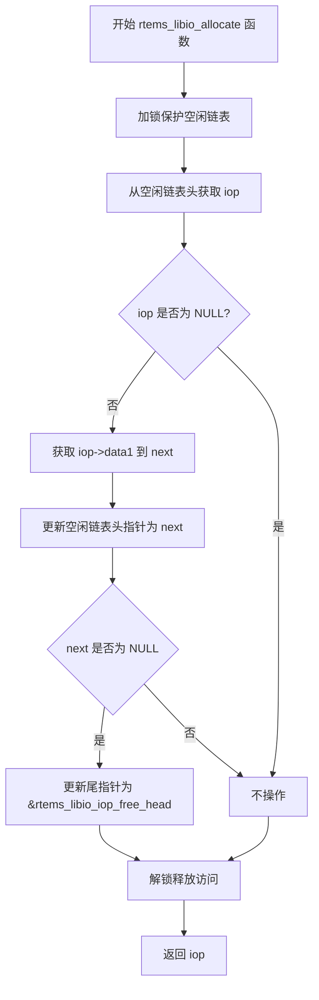

##### rtems_libio_iop_free_head

rtems_libio_iop_free_head 是一个全局变量，用于维护 Rtems 文件描述符（rtems_libio_t）的空闲链表头指针。

在初始化阶段，Rtems 会预分配一定数量的 rtems_libio_t 结构，并通过 data1 字段将它们串成一个单向链表。rtems_libio_iop_free_head 指向第一个可用节点。每次 rtems_libio_allocate() 被调用时，从头部取出一个节点，并更新链表。如果分配后链表为空，rtems_libio_iop_free_tail 会被指向 &rtems_libio_iop_free_head，表示空了。释放节点时会调用一个对应的 rtems_libio_free(iop)，将节点重新挂回链表尾部。

那其实对于 rtems_libio_t 链表而言，在预分配的时候就需要将 rtems_filesystem_location_info_tt 中关于文件系统全局的 rtems_filesystem_file_handlers_r 和 rtems_filesystem_mount_table_entry_tt 信息写入，这样才能保证系统调用的时候能够成功调用底层函数。

初始化阶段的函数逻辑如下：


rtems_libio_iops 是 Rtems 预先分配的 I/O 控制块数组，配置了 CONFIGURE_MAXIMUM_FILE_DESCRIPTORS 以后，会预先创建出这个数组。

问题来了：有了这个数组，为什么还要一个额外的 free list 链表来管理呢？

```c
#if CONFIGURE_MAXIMUM_FILE_DESCRIPTORS > 0
rtems_libio_t rtems_libio_iops[CONFIGURE_MAXIMUM_FILE_DESCRIPTORS];

const uint32_t rtems_libio_number_iops = RTEMS_ARRAY_SIZE(rtems_libio_iops);
#endif
```

#### do_open()

open() 函数中分配好文件描述符结构以后，最终会到达 do_open() 函数的位置进行处理。

函数开始时，从 iop 获取文件描述符 fd，并根据 oflag 解析读写权限、创建、独占、截断和目录打开等标志。然后确定是否跟随符号链接，组合路径解析所需的权限标志 eval_flags。

接着初始化路径解析上下文，解析路径并获取当前文件系统位置。若支持创建普通文件且路径未结束，则调用创建文件的函数。随后判断是否以目录方式打开，并检查写权限和目录类型的合法性，防止写目录或以目录方式打开非目录。

路径信息保存到 iop->pathinfo，清理路径解析上下文后，设置文件控制标志，调用底层驱动的 open 函数打开文件。若成功且指定截断，则调用 ftruncate 截断文件内容，截断失败时关闭文件。

最后，若操作全部成功，设置文件打开标志并返回文件描述符；失败时释放资源并返回错误。整个过程确保了路径解析、权限检查和文件打开的正确性和安全性。

do_open() 函数的执行流程图如下：

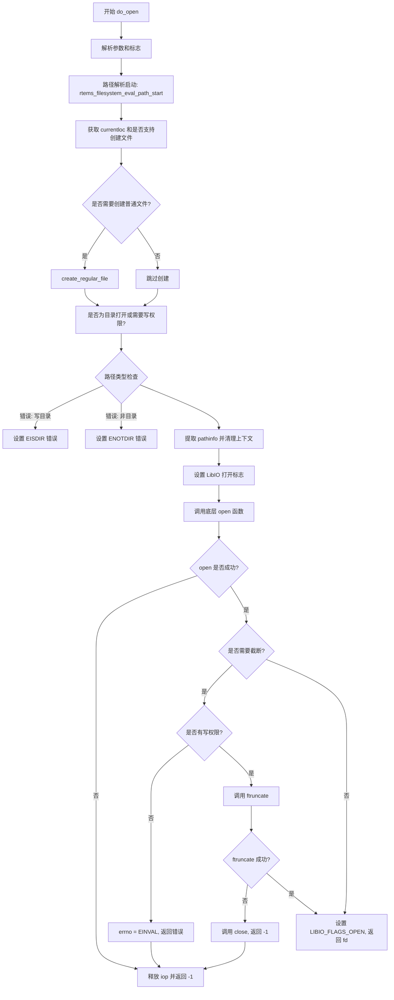

##### 路径解析过程

do_open() 涉及到的路径解析代码片段如下：

```c
// 启动路径解析，准备解析文件路径。
rtems_filesystem_eval_path_start(&ctx, path, eval_flags);

// 获取解析后的当前路径位置信息。
currentloc = rtems_filesystem_eval_path_get_currentloc(&ctx);
```

rtems_filesystem_eval_path_start() 的执行流程图如下：

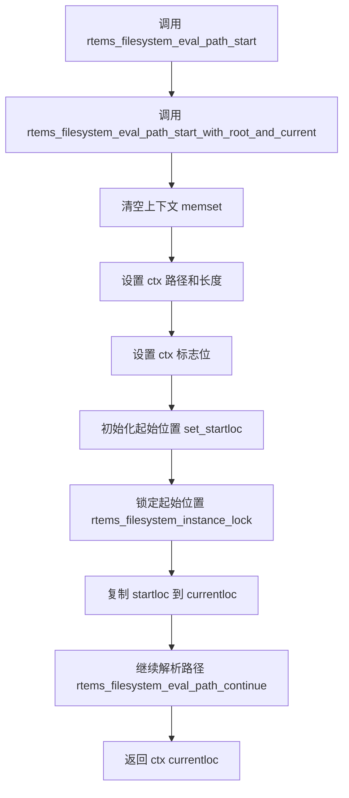

可以看出最后进入了 rtems_filesystem_eval_path_continue() 函数，嵌套太深了。目前看不懂整个路径的解析过程。

路径解析完毕后，do_open() 函数中执行以下函数用于维护状态：

```c
// 获取解析后的当前路径位置信息。
currentloc = rtems_filesystem_eval_path_get_currentloc(&ctx);

// 判断当前路径所在文件系统是否允许创建普通文件。
create_reg_file = !currentloc->mt_entry->no_regular_file_mknod;

......


// 将路径解析得到的当前路径信息保存到 iop 的 pathinfo 中。
rtems_filesystem_eval_path_extract_currentloc(&ctx, &iop->pathinfo);

// 清理路径解析上下文，释放资源。
rtems_filesystem_eval_path_cleanup(&ctx);
```

##### 底层文件系统的 open 函数

拿到所有信息以后，do_open() 函数中调用底层文件系统的 open() 函数真正打开文件：

```c
// 调用底层文件系统的 open 函数打开文件。
rv = (*iop->pathinfo.handlers->open_h)(iop, path, oflag, mode);
```

### close()

close() 函数的执行流程图如下。在前面更改完状态标志位后，还是会进入到底层文件系统的 close_h 函数。

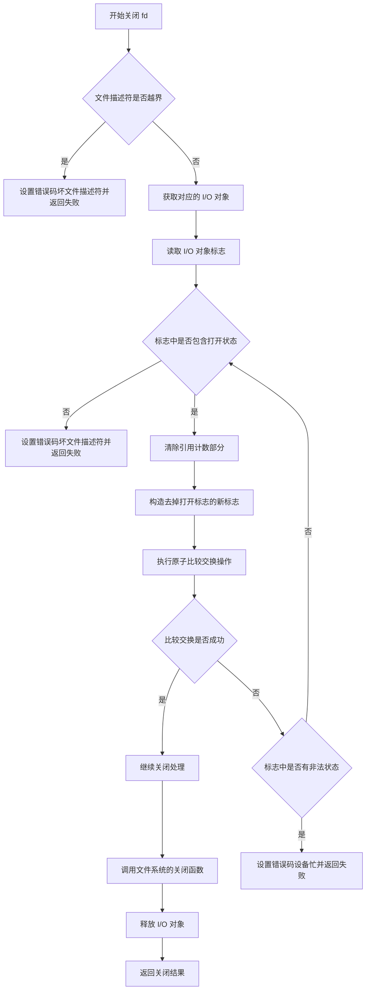

### read()

read() 函数的执行流程图如下。可以看出除了做了一些检查以外，直接调用了底层文件系统的 read_h() 函数。

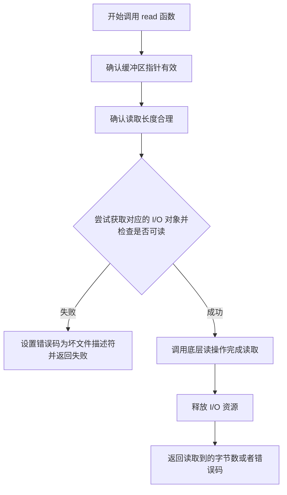

### write()

write() 函数的执行流程图如下。大致逻辑同样同 read 函数。

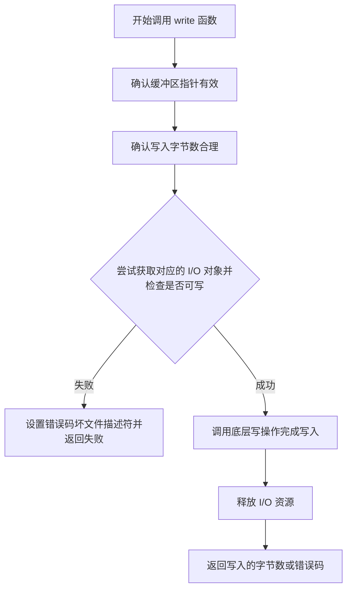

## 文件系统启动流程

### rtems_filesystem_initialize()

该函数用于初始化 Rtems 的根文件系统，通常是 IMFS。[官方文档](https://docs.rtems.org/docs/6.1/filesystem/system_init.html) 提到，其他文件系统可以被挂载，但它们只能挂载到基础文件系统中的某个目录挂载点。对于我们想注册的自定义文件系统，有两种手段，一种是在根文件系统挂载好以后，找到某个目录手动挂载新文件系统，另一种是直接修改 rtems_filesystem_root_configuration 根文件系统的配置，使用我们自己的文件系统，这样 Rtems 在启动的时候就会默认跑我们自己的文件系统。

rtems_filesystem_initialize() 函数的执行流程图如下：

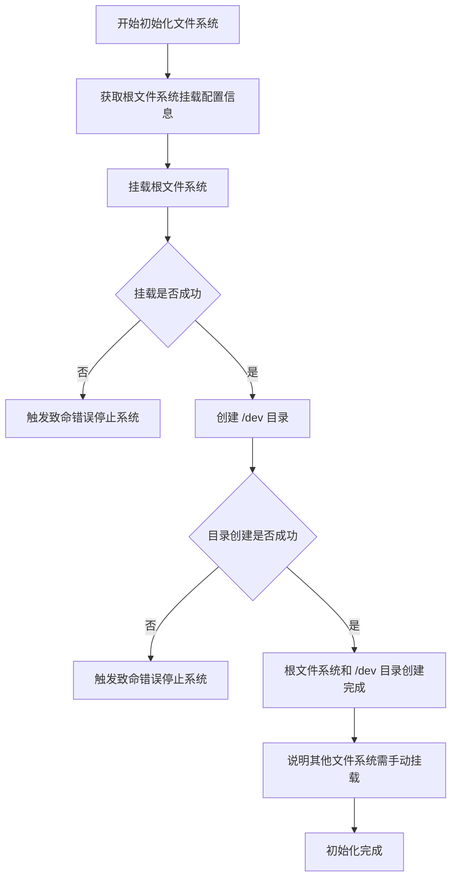

#### struct rtems_filesystem_mount_configuration

挂载根文件系统的挂载配置信息的结构体是 struct rtems_filesystem_mount_configuration。该结构体是 Rtems 中用于挂载文件系统时传递参数的配置结构。它的作用是将挂载一个文件系统所需的各种信息（如设备源、挂载点、文件系统类型等）集中在一起，作为参数传给 mount() 函数。

```c
typedef struct
{
    // 描述挂载源，通常是设备路径，如 "/dev/sd0"；对 IMFS 等内存文件系统可为 NULL。
    const char *source;

    // 挂载目标目录，必须是系统中已存在的路径，如 "/" 或 "/mnt/usb"。
    const char *target;

    // 文件系统类型的名称字符串，如 "imfs"、"dosfs"、"devfs" 等。
    const char *filesystemtype;

    // 挂载选项，定义为 rtems_filesystem_options_t 类型，控制如只读、读写等行为。
    rtems_filesystem_options_t options;

    // 指向文件系统特定的附加数据，一般为 NULL，某些文件系统可能使用此字段传递配置。
    const void *data;
} rtems_filesystem_mount_configuration;
```

在 rtems_filesystem_initialize() 中，根文件系统的配置是预定义好的全局变量 rtems_filesystem_root_configuration。

```c
const rtems_filesystem_mount_configuration rtems_filesystem_root_configuration = {
    NULL,
    NULL,
    "/",
    RTEMS_FILESYSTEM_READ_WRITE,
    &IMFS_root_mount_data,
};
```

### rtems_filesystem_register()

rtems_filesystem_register() 用于在 Rtems 操作系统中注册一个新的文件系统类型。它接收文件系统的类型名称和对应的挂载函数指针，动态分配内存创建一个文件系统节点，将类型名称和挂载函数保存到该节点中，并检查该类型是否已被注册。如果未注册，则将该节点添加到全局文件系统链表完成注册；如果已注册，则释放内存并返回错误。通过这个注册机制，系统能够识别和管理多种文件系统类型，并在需要时调用对应的挂载函数进行挂载操作。

rtems_filesystem_register() 的执行流程图如下：

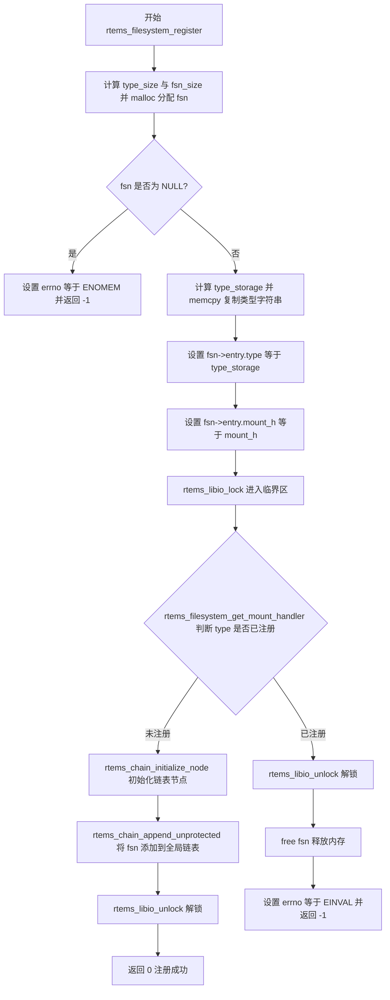

#### struct filesystem_node

struct filesystem_node 结构体的作用是将一个文件系统的描述信息封装为链表中的一个节点，使得多个文件系统表项可以通过链表的形式组织和管理。它结合了 Rtems 的链表节点结构 rtems_chain_node 与文件系统表项 rtems_filesystem_table_t，方便在系统中动态维护、查找和操作支持的文件系统。该结构体通常用于构建一个文件系统注册表，实现对多个文件系统的统一管理和遍历。

```c
// 定义一个结构体类型 filesystem_node，用于表示文件系统链表中的一个节点。
typedef struct
{
    // RTEMS 提供的双向链表节点结构，用于将多个文件系统节点连接成链表。
    rtems_chain_node node;

    // 文件系统表项，包含该文件系统的初始化函数、挂载函数等描述信息。
    rtems_filesystem_table_t entry;
} filesystem_node;
```

#### struct rtems_filesystem_table_t

struct rtems_filesystem_table_t 结构体的作用是描述一个可挂载的文件系统类型，包括文件系统的类型名称和对应的挂载函数。它为 RTEMS 提供了一种统一的方式来表示和管理不同类型的文件系统，使系统能够在运行时根据类型名称选择合适的挂载函数进行文件系统初始化和挂载操作。这种设计有助于扩展文件系统支持，并实现灵活的文件系统管理机制。

在 rtems_filesystem_register() 函数中，成员 type 和 mount_h 通过函数参数传入，并在函数内赋值。

```c
// 定义一个结构体类型 rtems_filesystem_table_t，用于描述一个可挂载的文件系统类型。
typedef struct rtems_filesystem_table_t
{
    // 文件系统的类型名称，通常为字符串形式，例如 "imfs" 或 "dosfs"。
    const char *type;

    // 文件系统的挂载函数指针，用于挂载该类型的文件系统。
    rtems_filesystem_fsmount_me_t mount_h;
} rtems_filesystem_table_t;
```

#### rtems_filesystem_fsmount_me_t

rtems_filesystem_fsmount_me_t 是一个函数指针，定义如下：

```c
/**
 * @brief 初始化一个文件系统实例。
 *
 * 该函数负责初始化挂载表项中的文件系统根节点。
 *
 * @param[in] mt_entry 指向挂载表项的指针，表示要挂载的文件系统实例。
 * @param[in] data 用户提供的初始化数据，如设备路径或挂载选项。
 *
 * @retval 0 操作成功，文件系统实例初始化完成。
 * @retval -1 操作失败，设置 errno 以指示具体错误。
 */

// 定义函数指针类型 rtems_filesystem_fsmount_me_t，表示挂载文件系统的函数。
// 该函数接受挂载表项指针和用户数据作为参数，返回挂载结果。
// 返回 0 表示挂载成功，返回 -1 表示挂载失败且设置 errno。
typedef int (*rtems_filesystem_fsmount_me_t)(
    rtems_filesystem_mount_table_entry_t *mt_entry, // 指向挂载表项，表示要挂载的文件系统。
    const void *data                                // 用户传入的初始化数据。
);
```

struct rtems_filesystem_mount_table_entry_t 结构体的作用是为每一个已挂载的文件系统提供一个集中式的描述，包含了文件系统的根节点信息、挂载点、类型、设备、访问控制状态等关键信息。Rtems 会维护一个这样的挂载表链表，每个表项都是这个结构体的一个实例。在挂载和卸载文件系统时，Rtems 会对这个结构体进行相应的初始化、操作或释放。文件系统的挂载、查找路径、访问权限、卸载等都依赖于这个结构体中记录的信息。

关于 struct rtems_filesystem_mount_table_entry_tt 和 struct _rtems_filesystem_operations_table，前面在 struct rtems_libio_t 的时候提到过，不再赘述。

### rtems_fsmount()

rtems_fsmount() 函数的作用是批量挂载多个文件系统，它按照用户提供的挂载表（fstab）顺序，依次创建每个挂载点目录并调用 mount() 执行挂载操作。该函数支持错误报告和失败控制机制，允许用户根据挂载结果决定是否继续处理后续项。通过这种方式，rtems_fsmount 提供了一种统一、高效的接口，适用于系统启动时自动挂载多个文件系统，简化了挂载流程并增强了可配置性。

rtems_fsmount() 的执行流程图如下：

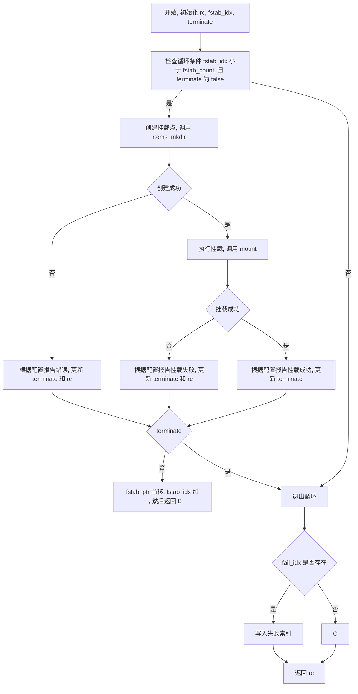

#### struct rtems_fstab_entry

struct rtems_fstab_entry 用于描述单个文件系统的挂载配置信息，包括挂载源设备或路径、挂载点目录、文件系统类型以及挂载时的选项和行为控制标志。它为系统批量挂载文件系统时提供了统一的数据格式，使挂载操作可以根据该结构体中的信息依次执行，支持对挂载过程中的错误报告和中止条件进行灵活管理。

```c
// 文件系统挂载表条目结构体。
// 用于描述一个文件系统的挂载信息，包括挂载源、挂载点、文件系统类型及挂载选项。
typedef struct
{
    // 挂载源，表示要挂载的设备、分区或路径。
    const char *source;

    // 挂载目标，即挂载点路径，文件系统将挂载到该目录下。
    const char *target;

    // 文件系统类型名称，如 "imfs"、"dosfs" 等。
    const char *type;

    // 文件系统挂载选项，包含挂载时的参数配置。
    // // 文件系统挂载选项枚举类型，定义了文件系统挂载时支持的不同访问权限模式。
    // typedef enum
    // {
    //     // 只读模式，文件系统以只读方式挂载。
    //     RTEMS_FILESYSTEM_READ_ONLY,

    //     // 读写模式，文件系统以读写方式挂载。
    //     RTEMS_FILESYSTEM_READ_WRITE,

    //     // 无效或错误的挂载选项。
    //     RTEMS_FILESYSTEM_BAD_OPTIONS
    // } rtems_filesystem_options_t;
    rtems_filesystem_options_t options;

    // 报告条件标志，用于指定哪些情况需要报告错误或信息。
    uint16_t report_reasons;

    // 终止条件标志，用于指定哪些情况会导致挂载流程终止。
    uint16_t abort_reasons;
} rtems_fstab_entry;
```

#### mount()

mount() 函数用于根据指定的源路径、目标挂载点、文件系统类型和挂载选项，完成文件系统的挂载操作。它首先根据文件系统类型获取对应的挂载处理函数，然后创建一个挂载表项来保存挂载信息，调用具体文件系统的挂载函数进行挂载，并将挂载点注册到系统的文件系统层次中。如果挂载或注册失败，会进行相应的资源释放和错误处理。函数最终返回挂载结果，成功返回 0，失败返回 -1 并设置相应的错误码。

mount() 函数的执行流程图如下：

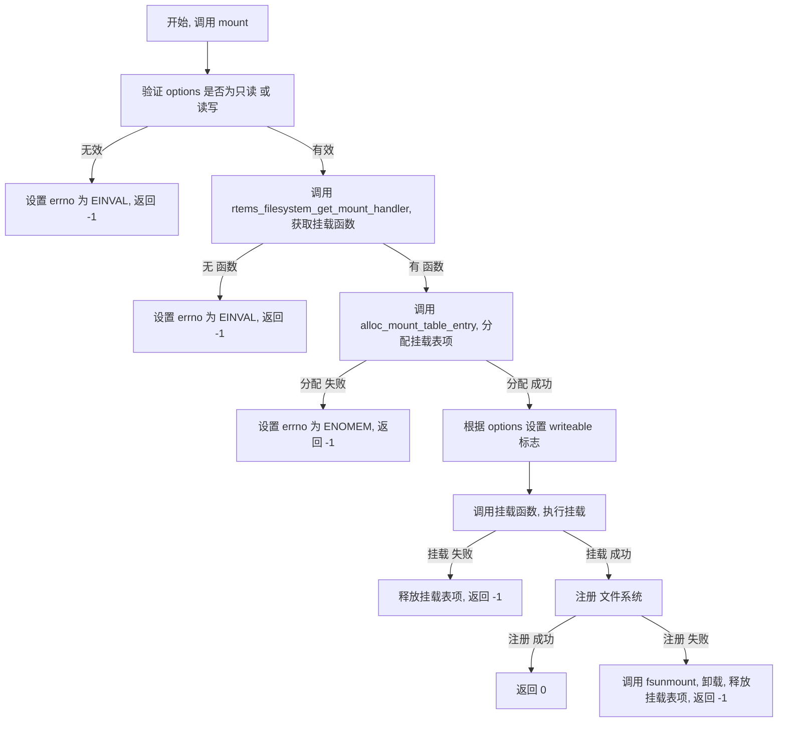

## IMFS 文件系统

IMFS（In‐Memory File System）是 Rtems 提供的一个内存文件系统。它将文件和目录全部存储在 RAM 中，为嵌入式应用提供快速、轻量级的 POSIX 风格文件操作接口；其核心模块负责管理目录树结构、路径解析和文件读写逻辑，而底层的节点分配与销毁、元数据初始化等则通过回调函数（如 node_initialize、node_remove、node_destroy）由系统默认实现或用户自定义实现来完成，使得 IMFS 在不修改主体框架的情况下能够灵活适配不同内存布局或特殊需求，启动时通过 IMFS_initialize 自动注册并挂载为根文件系统，用户即可直接使用标准的 open/read/write/close 等接口访问内存中存储的文件。

### rtems_filesystem_get_mount_handler()

在 rtems_filesystem_register() 中，有一步是调用 rtems_filesystem_get_mount_handler 函数判断节点类型是否注册。这不仅让我们联想到，可能 Rtems 内部维护了一张全局表，专门用于记录目前已挂载的文件系统的信息。

rtems_filesystem_get_mount_handler() 的执行流程如下。

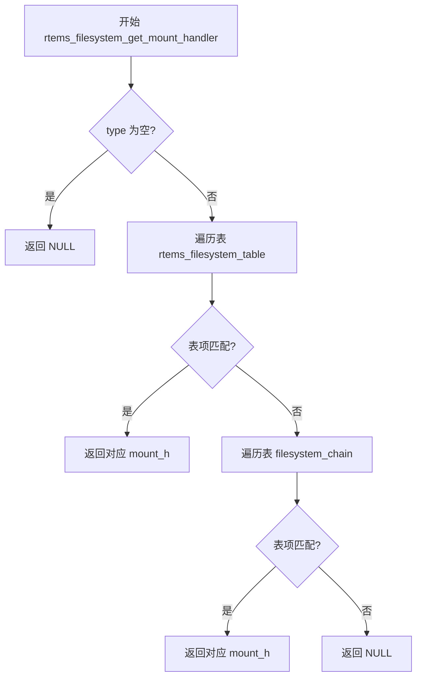

在 rtems_filesystem_iterate 函数中，可以发现 Rtems 定义了全局的两个表 filesystem_chain 和 rtems_filesystem_table。源码中无法直接跳转 filesystem_chain，目前无法得知他的具体状况。

```c
rtems_chain_control *chain = &filesystem_chain;

const rtems_filesystem_table_t *table_entry = &rtems_filesystem_table[0];
```

关于 rtems_filesystem_table，它用于表示挂载的文件系统的信息，并且猜测大概率是预挂载的文件系统的信息。定义如下：

```c
const rtems_filesystem_table_t rtems_filesystem_table[] = {
    {"/", IMFS_initialize_support},
#ifdef CONFIGURE_FILESYSTEM_DOSFS
    {RTEMS_FILESYSTEM_TYPE_DOSFS, rtems_dosfs_initialize},
#endif
#ifdef CONFIGURE_FILESYSTEM_FTPFS
    {RTEMS_FILESYSTEM_TYPE_FTPFS, rtems_ftpfs_initialize},
#endif
#ifdef CONFIGURE_FILESYSTEM_IMFS
    {RTEMS_FILESYSTEM_TYPE_IMFS, IMFS_initialize},
#endif
#ifdef CONFIGURE_FILESYSTEM_JFFS2
    {RTEMS_FILESYSTEM_TYPE_JFFS2, rtems_jffs2_initialize},
#endif
#ifdef CONFIGURE_FILESYSTEM_NFS
    {RTEMS_FILESYSTEM_TYPE_NFS, rtems_nfs_initialize},
#endif
#ifdef CONFIGURE_FILESYSTEM_RFS
    {RTEMS_FILESYSTEM_TYPE_RFS, rtems_rfs_rtems_initialise},
#endif
#ifdef CONFIGURE_FILESYSTEM_TFTPFS
    {RTEMS_FILESYSTEM_TYPE_TFTPFS, rtems_tftpfs_initialize},
#endif
    {NULL, NULL}};
```

TODO

# 参考文档

1. [RTEMS Filesystem Design Guide (6.1). — RTEMS Filesystem Design Guide 6.1 (22nd January 2025) documentation](https://docs.rtems.org/docs/6.1/filesystem/index.html)
2. [rtems文件系统部分 - 《ext4文件系统移植》 - 极客文档](https://geekdaxue.co/read/linggs@qnf7q6/pnhxbw)

