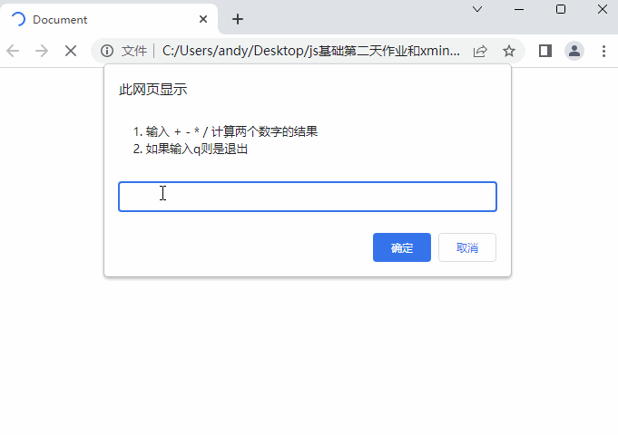

# 一、每日作业-JavaScript第02天

## 主观题

### 核心知识点

1. 打印0-20之间的整数, 将每个数输出到控制台

   ~~~javascript
   
   ~~~

2. 计算1-1000之间的累加和，并且打印输出到页面中

   ~~~html
   
   ~~~

3. 页面依次打印 100-200之间,可以被6整除的数字

   ~~~html
   
   ~~~

4. 用户弹窗输入两个数字，页面输出两个数字中的最大值（请使用三元运算符完成）

   ~~~html
   课堂练习，不需要pink老师写了吧
   ~~~

5. **用户输入一个数，  计算 1 到这个数的累加和** 

   - 比如 用户输入的是 5， 则计算 1~5 之间的累加和
   - 比如用户输入的是10， 则计算 1~10 之间的累加和

   ~~~html
   
   ~~~

6. **输出成绩案例（请使用if多分支来书写程序）**

   题目描述：

   接收用户输入的分数，根据分数输出对应的等级字母 A、B、C、D、E，

   - 90分(含)以上 ，输出：A
     80分(含)~ 90 分(不含)，输出：B	
      70分(含)~ 80 分(不含)，输出：C 	
      60分(含)~ 70 分(不含)，输出：D   	
   - 60分(不含) 以下，输出 E

   ~~~html
   课堂案例类似不需要pink老师再啰嗦了吧~~
   ~~~

7. **输出星期练习（请使用switch分支语句来书写程序）**

   题目描述：

   请用户输入1个星期数. 就将对应的英文的星期打印出来. 

   - 比如用户输入'星期一'， 则 页面可以打印  monday 
   - 英文自己查有道。比如星期一是  monday  星期二是 tuesday

   ~~~html
   
   ~~~

   ​

8. **用户登录验证**

   题目描述：

   接收用户输入的用户名和密码，若用户名为 “admin” ,且密码为 “123456” ,则提示用户登录成功!  否则，让用户一直输入。

   ~~~javascript
   while (true) {
       let msg = prompt('名字')
       let pwd = prompt('密码')
       if (msg === 'admin' && pwd === '123456') {
           break
       }
   }
   alert('登录成功')

   ~~~

### 综合案例变形

需求：根据用户选择计算两个数的结果：

**题目描述：**

打开页面出现一个提示框，注意是一直提示的，'请您选择 + - * / ，如果输入q，则是退出结束程序

- 如果输入的是 + - * / 其中任何一个，比如用户输入是 + ，则是计算求和，如果用户输入是 *  则是计算乘积
  - 则提示第一个弹窗，提示用户：'请您输入第一个数字'
  - 输入完毕则继续提示第二个弹窗，提示用户：'请您输入第二个数字'
  - 都输入完毕，则通过警示框 alert 输出结果
- 如果输入是 q，则结束程序

提示：多分支请使用 if 多分支来完成

具体效果如图：

 

~~~html

~~~

## 排错题

### 排错题1

~~~javascript
<!-- 请问以下代码会出现什么问题，如何解决？ -->

~~~

### 排错题2

~~~javascript
<!-- 请问下面代码会出现什么问题，怎么去解决？ -->

~~~

### 排错题3

~~~html
<body>
  <!-- 请问以下代码会出什么问题？如何解决？ -->
  
</body>
~~~

### 排错题4

~~~html
<body>
  <!-- bug:请你找到下面代码代码穿透的原因,并找到匹配不上case里面的值的问题进行修改 -->

  
~~~

## 客观题

地址：https://ks.wjx.top/vm/tjmrvAg.aspx# 

请扫码做题 

 

## 简答题：关键字汇总( 能够简单的说出来这些关键字干啥用的 )

- let    声明变量
- typeof   检测数据类型
- if   条件语句如果
- else   否则 
- switch    分支语句   
- case   选项
- default      默认语句
- while    
- break    退出循环
- continue    继续下一次循环

## 关注pink老师

关于pink老师抖音（黑马pink讲前端），领取学习路线图、面试宝典以及八大学科的基础视频哦~~

 

