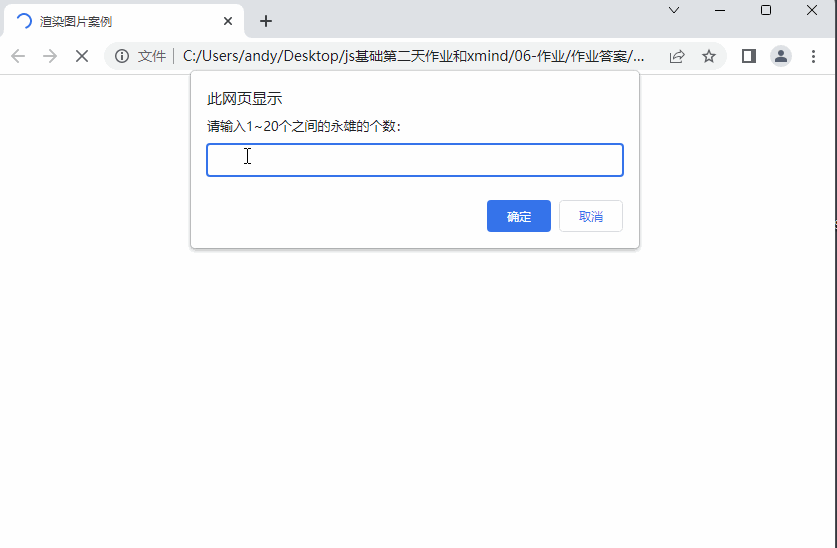

#  JavaScript基础第三天作业

## 主观题

### 综合大练习：

写一个程序，要求如下（★★） 

* 需求1：让用户输入五个有效年龄（0-100之间），**放入数组中**

  * 必须输入五个有效年龄年龄，如果是无效年龄，则不能放入数组中
* 需求2：打印出所有成年人的年龄 (数组筛选)
* 需求3：打印出所有人总年龄 （累加）
* 需求4：打印出所有人的平均年龄 （累加）
* 需求5：打印出最大年龄和最小年龄 （最大值）


答案：

~~~javascript
  /* 1.让用户输入五个有效年龄（0-100之间），放入数组中 */
//1.声明累加数组
let arr = []
//2.循环遍历
while( arr.length < 5 ){
    //输入年龄
    let num = +prompt(`请输入第${arr.length+1}个人有效年龄`)
    //判断是否有效
    if( num > 0 && num < 100){
        //添加到数组
        arr.push(num)
    }
}
   console.log(arr)
    // 2. 打印输出成人的年龄  年龄 > 18 
    for (let i = 0; i < arr.length; i++) {
      if (arr[i] >= 18) {
        document.write(`已经成人的年龄是: ${arr[i]} <br>`)
      }
    }
    //  需求3：打印出所有人总年龄 （累加）
    let sum = 0
    for (let i = 0; i < arr.length; i++) {
      sum += arr[i]
    }
    document.write(`所有人的年龄是: ${sum} <br>`)
    // 需求4：打印出所有人的平均年龄 （累加）
    let average = 0
    average = sum / arr.length
    document.write(`所有人的年龄是: ${average} <br>`)
    // 需求5：打印出最大年龄和最小年龄 （最大值）   假设法
    let max = arr[0]
    let min = arr[0]
    for (let i = 1; i < arr.length; i++) {
      if (max < arr[i]) {
        max = arr[i]
      }
      if (min > arr[i]) {
        min = arr[i]
      }
    }
    document.write(`最大值是: ${max} <br>`)
    document.write(`最小值是: ${min} <br>`)
   // 需求5：打印出最大年龄和最小年龄 （最大值）   排序法
     arr.sort(function (a, b) {
      return a - b;
    }) // 升序
    let min = arr[0]  // 
    let max = arr[arr.length - 1]  // 56
~~~


### 练习题2：

找出数组中 元素为10的下标，有则打印该下标，没有则打印-1

* 例如: [88,20,10,100,50]  打印 2
* 例如: [88,20,30,100,50]  打印-1

~~~javascript
// 找出数组中 元素为10的下标，有则打印该下标，没有则打印 - 1
let arr = [88, 20, 10, 100, 50]
let re = -1  // 用于存储结果,默认没有
for (let i = 0; i < arr.length; i++) {
    if (arr[i] === 10) {
        re = i  //如果找到则把当前索引号赋值给 re， 如果没有找到，则默认的是 -1
        break // 已经找到就退出
    }
}
console.log(re)
~~~

 ### 练习题3: 

使用for循环 - 求出数组元素的和 [5, 8, 9, 2, 1, 5]
     

```javascript
 // 遇到数组 先把遍历写出来!!!!!!!!!!!!!!!=> 访问数组里面的单元的值

let arr = [5, 8, 9, 2, 1, 5]
let sum = 0
for (let i = 0; i < arr.length; i ++) {
    // sum = sum + item
    sum += item
}
console.log(sum) // 30
```

### 练习题4: 

使用for循环 - 求出数组里大于5的i和 [4, 9, 5, 20, 3, 11]

```javascript
let arr =   [4, 9, 5, 20, 3, 11]
for (let i= 0; i < arr.length; i++) {
    if (arr[i] > 5) {
        sum += arr[i]
    }
}
console.log(sum) 

```

### 练习题5: 

使用for循环 - 求出班级里同学们平均年龄[15, 19, 21, 33, 18, 24]

### 练习题6: 

计算[2, 6, 18, 15, 40] 中能被3整除的偶数的和

### 练习题7：

计算[2, 6, 18, 15, 40] 中能被3整除的偶数的个数

### 练习题8：

给一个数字数组，该数组中有很多数字0，将不为0的数据存入到一个新的数组中

###  核心练习题

需求：

根据用户输入的个数，页面可以渲染对应王者荣耀永雄的个数

效果如下：

 

思路分析：

1. 渲染图片比较多，我们可以把图片地址放入数组中，
2. 图片名称是有序号排列的，比如1.webp  2.webp 此处可以使用循环方式重复渲染图片
3. 渲染位置？ 可以考虑放到 box盒子里写script 即可

答案：

~~~html
<!DOCTYPE html>
<html lang="en">

<head>
  <meta charset="UTF-8">
  <meta http-equiv="X-UA-Compatible" content="IE=edge">
  <meta name="viewport" content="width=device-width, initial-scale=1.0">
  <title>渲染图片案例</title>
  <style>
    * {
      margin: 0;
      padding: 0;
    }

    li {
      list-style: none;
    }

    .box {
      display: flex;
      flex-wrap: wrap;
      width: 540px;
      margin: 20px auto;
    }


    .box li {
      width: 100px;
      height: 100px;
      margin: 0 10px 10px 0;
    }

    .box li:nth-child(5n+1) {
      margin-right: 0;
    }

    .box li img {
      width: 100%;
      height: 100%;
      border: 2px solid #258DF2;
      border-radius: 10px 0 10px 0;
    }
  </style>
</head>

<body>
  <ul class="box">
    <script>
      let arr = [
        './images/1.webp',
        './images/2.webp',
        './images/3.webp',
        './images/4.webp',
        './images/5.webp',
        './images/6.webp',
        './images/7.webp',
        './images/8.webp',
        './images/9.webp',
        './images/10.webp',
        './images/11.webp',
        './images/12.webp',
        './images/13.webp',
        './images/14.webp',
        './images/15.webp',
        './images/16.webp',
        './images/17.webp',
        './images/18.webp',
        './images/19.webp',
        './images/20.webp'
      ]
      let num = prompt('请输入显示的英雄个数1~20之间：')
      for (let i = 0; i < num; i++) {
        document.write(`
          <li>
            
          </li>
        `)
      }
    </script>
  </ul>
</body>

</html>
~~~


## 排错题

### 拍错题1

~~~html
<body>
  <!-- 请问以下代码会出现什么问题，如何解决？ -->
  <script>
    // 需求： 求 1~100之间的累加和
    // 注意： 此处有3个错误，找出并且修正
    let sum   //错误1： sum 必须初始化为0，如果默认是是undefined，相加结果是 NaN
    for (let i = 1; i < 100; i++;) {  // 错误2： 从1开始，是小于等于。 错误3： i++ 后面不需要加分号
      sum += i
    }
    console.log(sum)
  </script>
</body>
~~~

### 排错题2

~~~html
<!-- bug:请你找到下面代码的bug,把数字1打印出来 -->
<body>
  <script>
    let sum = 0
    let arr = [1, 2, 3, 4, 5]
    for (let i = 1; i < arr.length; i++) { // 错误： i 从 0 开始 
      console.log(arr[i])
    }
  </script>
</body>
~~~

### 排错题3

~~~html
<!-- bug:找到下面代码死循环的原因,并修改为正确的代码 -->

<body>
  <script>
    for (let i = 1; i <= 5; i++) {
      for (let j = 1; j <= 5; i++) {  // 错误： 这里是j++ 不是i++ ，不是考察同学眼力，而是很多同学不小心就写这个了，要小心
        console.log(`这是双重for循环`);
      }
    }
  </script>
</body>
~~~


## 客观题

请扫码做客观题

PC端地址：https://ks.wjx.top/vm/eeLxrmN.aspx# 

二维码：

 

关于pink老师抖音（黑马pink讲前端），领取学习路线图、面试宝典以及八大学科的基础视频哦~~

 


