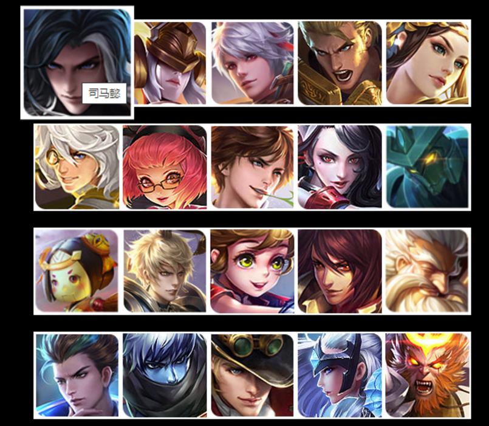
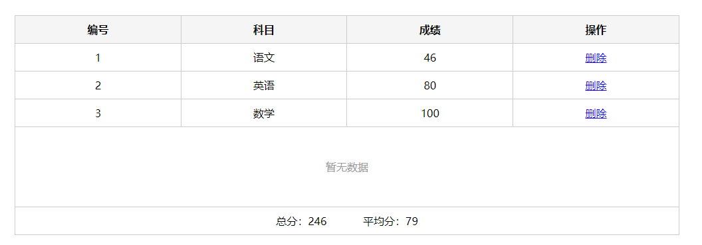

## 客观题

PC端地址：https://ks.wjx.top/vm/hgfFlVd.aspx# 

二维码扫码：

 

## 主观题

### 练习题1：

点名: 每次刷新网页运行, 在控制台 随机输出一位同学的名字 ["老赵", "老李", "小传", "小黑"]，如果输出了，则数组中删除这个名字

~~~html
这个课堂讲过，pink老师坚决不写答案
~~~

### 练习题2：

声明对象

目的: 复习对象的声明

要求:

1. 声明一个变量per, 类型为对象类型
2. 该对象的属性为性别,年龄,爱好(3个)
3. 该对象的方法有 说话, 吃饭(2个)
4. 在控制台分别调用该对象的属性和方法

~~~javascript
let per = {
  sex: 'man', // 年龄,
  age: 18, // 性别,
  hobby: 'studyAndGame', // 爱好
   speak: function () {
    // 说话,
     document.write(`speak方法被调用了---  `)
   },
   eat: function () {
    // 吃饭
     document.write(`eat方法被调用了---`)
   }
}
// 下面是调用部分
document.write(`姓名:${per.sex}  `)
document.write(`姓名:${per.age} `)
document.write(`姓名:${per.hobby} `)
// 调用方法
per.speak()
per.eat()

~~~

### 练习题3：

调用对象的方法

目的: 复习对象的使用

要求:

1. 对象声明完毕后, 调用对象中的吃饭的方法
2. 提示: 对象中的方法本质是函数, 调用需要加()
3. 方法也可以传递参数的

~~~javascript
let per = {
  sex: 'man', // 年龄,
  age: 18, // 性别,
  hobby: 'studyAndGame', // 爱好
  speak: function () {
    // 说话,
     document.write(`speak方法被调用了--- `)
   },
   eat: function (f) {
    // 吃饭
    document.write(`我今天吃的是${f}`)
   }
}
// 下面是调用部分
document.write(`姓名:${per.sex}  `)
document.write(`姓名:${per.age} `)
document.write(`姓名:${per.hobby} `)

// 调用方法
per.speak()
per.eat('苹果')
~~~

### 练习题4：

猜数字游戏，设定次数，最多猜8次

~~~javascript
 function random(min, max) {

      return Math.floor(Math.random() * (max - min + 1)) + min
}
    // 生成一个数字先,猜0-20之间的数
    let num = random(0, 20)

    let flag = true
    // 最多猜8次
    for (let i = 1; i <= 8; i++) {

      let userNum = prompt('请输入您要猜的数字')

      // 比较数字
      if (userNum > num) {

        alert('您猜的数字大了')
      } else if (userNum < num) {

        alert('您猜的数字小了')
      } else {
        flag = false
        alert('恭喜猜对了！')
        break
      }
    }

    if (flag) {
      alert('太笨了，这都猜不到！O(∩_∩)O')
    }
		
~~~

### 练习题5：

完成课堂随机生成颜色的案例。

~~~html
课堂案例，同学你能写出来吗？
~~~

### 拓展作业1

**需求：** 利用对象数组渲染英雄列表案例

**展示效果：**如下：

功能1：

1. 利用对象数组里面的数据来渲染页面，渲染多个数据
2. 鼠标经过停留会显示`英雄名字`

数据：

~~~javascript
let datas = [
  { name: '司马懿', imgSrc: '01.jpg' },
  { name: '女娲', imgSrc: '02.jpg' },
  { name: '百里守约', imgSrc: '03.jpg' },
  { name: '亚瑟', imgSrc: '04.jpg' },
  { name: '虞姬', imgSrc: '05.jpg' },
  { name: '张良', imgSrc: '06.jpg' },
  { name: '安其拉', imgSrc: '07.jpg' },
  { name: '李白', imgSrc: '08.jpg' },
  { name: '阿珂', imgSrc: '09.jpg' },
  { name: '墨子', imgSrc: '10.jpg' },
  { name: '鲁班', imgSrc: '11.jpg' },
  { name: '嬴政', imgSrc: '12.jpg' },
  { name: '孙膑', imgSrc: '13.jpg' },
  { name: '周瑜', imgSrc: '14.jpg' },
  { name: 'XXX', imgSrc: '15.jpg' },
  { name: 'XXX', imgSrc: '16.jpg' },
  { name: 'XXX', imgSrc: '17.jpg' },
  { name: 'XXX', imgSrc: '18.jpg' },
  { name: 'XXX', imgSrc: '19.jpg' },
  { name: 'XXX', imgSrc: '20.jpg' }
]
~~~

答案：

~~~html
<!DOCTYPE html>
<html lang="en">

<head>
	<meta charset="UTF-8">
	<meta name="viewport" content="width=device-width, initial-scale=1.0">
	<meta http-equiv="X-UA-Compatible" content="ie=edge">
	<title>渲染英雄列表案例</title>
	<link rel="stylesheet" href="css/hero.css">
</head>

<body>
	<!-- 利用对象数组渲染英雄列表案例 -->
	<!-- <ul class="list">
		
	</ul> -->
	
</body>

</html>
~~~

### 拓展作业2

需求： 根据数据完成表格渲染

效果如下：

功能需求：

1. 表格行要求 编号、科目、成绩、和 删除链接
2. 最后计算出总分 和 平均分

数据如下：

~~~javascript
let data = [
  { subject: '语文', score: 46 },
  { subject: '数学', score: 80 },
  { subject: '英语', score: 100 },
]
~~~

答案：

~~~html
<!DOCTYPE html>
<html lang="en">

<head>
  <meta charset="UTF-8" />
  <meta http-equiv="X-UA-Compatible" content="IE=edge" />
  <meta name="viewport" content="width=device-width, initial-scale=1.0" />
  <link rel="stylesheet" href="./styles/index.css" />
  <title>Document</title>
</head>

<body>
  
</body>

</html>
~~~

## 排错题

### 排错题1

~~~html
<!-- bug:请你找到下面代码的2处BUG进行修改 -->

<body>
  
</body>
~~~

### 排错题2

~~~html
<!-- 请你找到下面代码的3处bug进行修改 -->

<body>
  
</body>
~~~

## 关注pink老师

经过基础5天学习，是不是很有收获呀，同时pink老师准备了很多资料给同学，看在辛苦的份上，没有一键三连的同学赶紧三连，同时记得关注我的抖音，里面经常发布各种资料哦~~~

 

