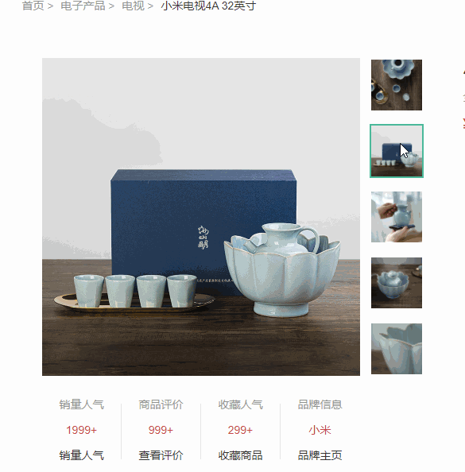
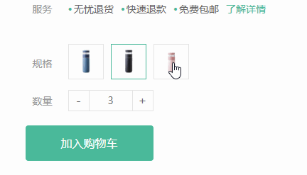
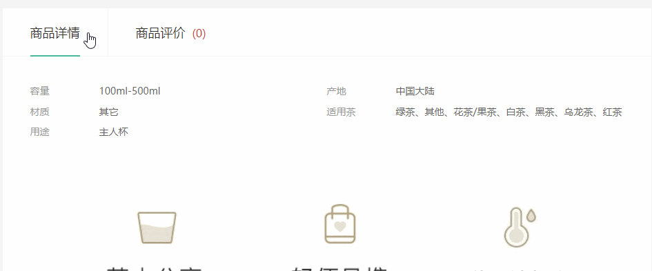

# 个人实战文档

本次实战是对自己整个api阶段的总结。

参考效果如下地址：

http://erabbit.itheima.net/#/product/3995139

本次实战主要分为以下几个模块。

## 顶部导航模块

需求：

1. 顶部导航开始不显示
2. 等页面滑到主导航栏，这个**新顶部导航栏滑动下拉显示**，并且改为固定定位
3. 等页面滑到上面，新顶部导航栏隐藏

## 图片切换模块

 

## 放大镜效果

业务分析：

①：鼠标经过对应小盒子，左侧中等盒子显示对应中等图片

②： 鼠标经过中盒子，右侧会显示放大镜效果的大盒子

③： 黑色遮罩盒子跟着鼠标来移动

④： 鼠标在中等盒子上移动，大盒子的图片跟着显示对应位置

思路分析：

①：鼠标经过小盒子，左侧中等盒子显示对应中等图片

1. 获取对应的元素
2. 采取事件委托的形式，监听鼠标经过小盒子里面的图片， 注意此时需要使用 `mouseover` 事件，因为需要事件冒泡触发small 
3. 让鼠标经过小图片的爸爸li盒子，添加类，其余的li移除类（注意先移除，后添加）
4. 鼠标经过小图片，可以拿到小图片的src， 可以做两件事
   - 让中等盒子的图片换成这个 这个小图片的src
   - 让大盒子的背景图片，也换成这个小图片的 src （稍后做）

②： 鼠标经过中等盒子，右侧大盒子显示

1. 用到鼠标经过和离开，鼠标经过中盒子，大盒子 利用 display 来显示和隐藏

2. 鼠标离开不会立马消失，而是有200ms的延时，用户体验更好，所以尽量使用定时器做个延时 setTimeout

3. 显示和隐藏也尽量定义一个函数，因为鼠标经过离开中等盒子，会显示隐藏，同时，**鼠标经过大盒子，也会显示和隐藏**

4. 给大盒子里面的背景图片一个默认的第一张图片

   ​

③： 黑色遮罩盒子跟着鼠标来移动

1.  先做鼠标经过 中等盒子，显示隐藏 黑色遮罩 的盒子

2.  让黑色遮罩跟着鼠标来走, 需要用到鼠标移动事件  mousemove  

3. 让黑色盒子的移动的核心思想：不断把鼠标在中等盒子内的坐标给黑色遮罩层 let  top 值，这样遮罩层就可以跟着移动了

   - 需求

     - 我们要的是 鼠标在 中等盒子内的坐标， 没有办法直接得到
     - 得到1：  鼠标在页面中的坐标
     - 得到2：  中等盒子在页面中的坐标

   - 算法

     - 得到鼠标在页面中的坐标    利用事件对象的  pageX  
     - 得到middle中等盒子在页面中的坐标   middle.getBoundingClientRect()
     - 鼠标在middle 盒子里面的坐标   =   鼠标在页面中的坐标  -   middle 中等盒子的坐标
     - 黑色遮罩层不断得到       鼠标在middle 盒子中的坐标 就可以移动起来了

     >注意 y坐标特殊，需要减去 页面被卷去的头部 
     >
     >为什么不用 box.offsetLet 和 box.offsetTop  因为这俩属性跟带有定位的父级有关系，很容被父级影响，而getBoundingClientRect() 不受定位的父元素的影响

   - 限定遮罩的盒子只能在middle 内部移动，需要添加判断

     - 限定水平方向 大于等于0 并且小于等于 400
     - 限定垂直方向 大于等于0 并且小于等于 400

   - 遮罩盒子移动的坐标： 

     - 声明一个 mx 作为移动的距离
     - 水平坐标 x 如果 小于等于100 ，则移动的距离 mx 就是  0  不应该移动
     - 水平坐标 如果 大于等于100 并且小于300，移动的距离就是  mx - 100 （100是遮罩盒子自身宽度的一半）
     - 水平坐标 如果 大于等于300，移动的距离就是  mx   就是200  不应该在移动了
     - 其实我们发现水平移动， 就在 100 ~ 200 之间移动的
     - 垂直同理

   ~~~javascript
   let mx = 0, my = 0;
   if (x <= 100) mx = 0
   if (x > 100 && x < 300) mx = x - 100
   if (x >= 300) mx = 200

   if (y <= 100) my = 0
   if (y > 100 && y < 300) my = y - 100
   if (y >= 300) my = 200
   ~~~

   - 大盒子图片移动的计算方法：
     - 中等盒子是 400px  大盒子 是 800px 的图片
     - 中等盒子移动1px， 大盒子就应该移动2px， 只不过是负值

   ~~~JavaScript
   large.style.backgroundPositionX = - 2 * mx + 'px'
   large.style.backgroundPositionY = - 2 * my + 'px'
   ~~~

   放大镜完整代码：

   ​

## 其他模块

此模块可以根据自己时间添加

### 点击模块

 

### tab栏切换模块

### 返回顶部模块

页面滚动底部，可以出现一个侧边栏，点击返回顶部，可以返回顶部

